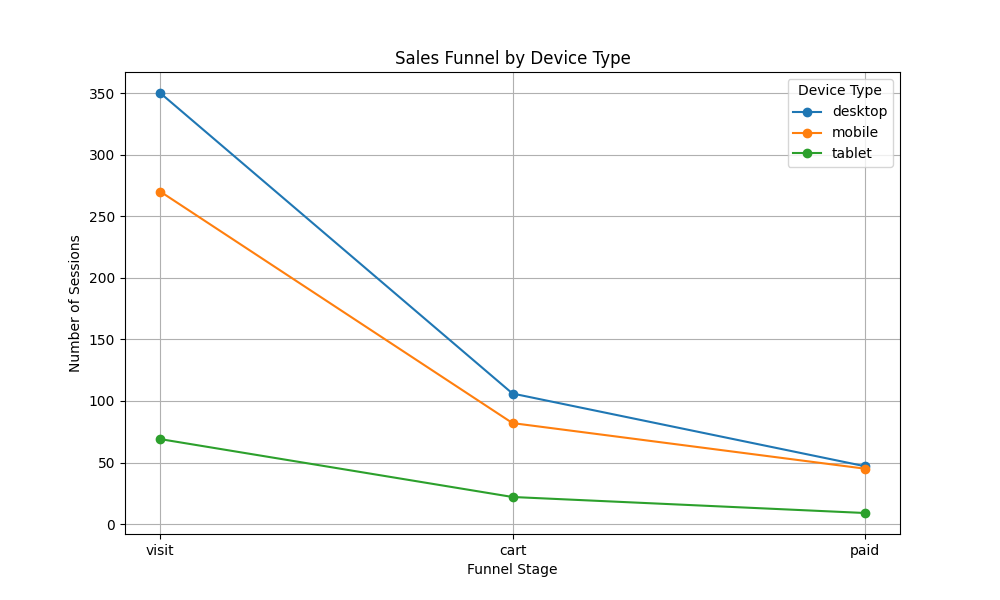
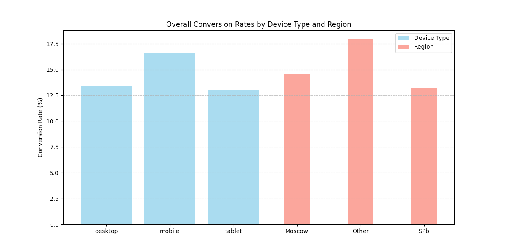
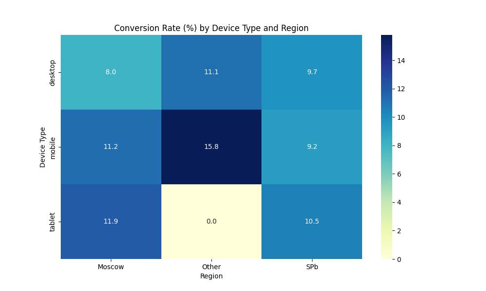
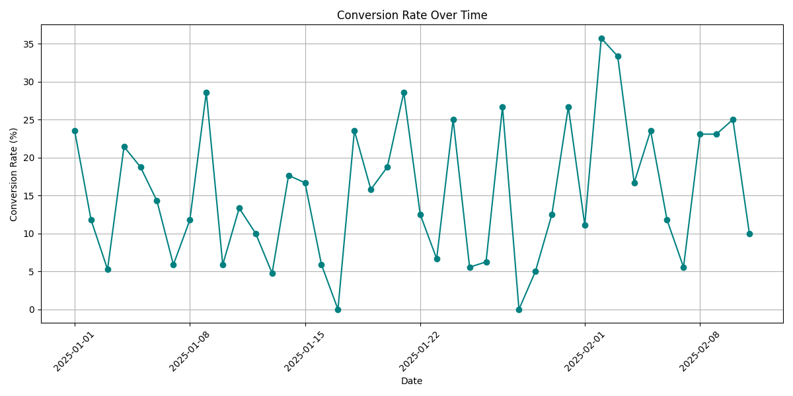

# Анализ воронки продаж (Funnel Analysis)

## Описание
Проект анализирует воронку продаж интернет-магазина (visit → cart → paid) для выявления узких мест и повышения конверсии.

## Цель
- Определить этапы с наибольшими потерями пользователей.
- Провести сегментацию по типам устройств, регионам и времени.
- Предложить рекомендации для улучшения.

## Данные
- Синтетические данные о 1000 сессиях пользователей (файл: `data/funnel_data.csv`).  
- Столбцы: `session_id`, `date`, `device_type`, `region`, `funnel_stage`.

## Подход
1. **Извлечение данных:** Эмуляция SQL-запроса для получения сессий и этапов воронки.  
2. **Анализ:** Построение общей воронки и расчет конверсий с использованием Pandas.  
3. **Сегментация:**  
   - По типам устройств (desktop, mobile, tablet).  
   - По регионам (SPb, Moscow, Other).  
   - По времени (тренд конверсии по дням).  
4. **Визуализация:**  
   - График воронки по устройствам (Matplotlib).  
   - Сравнительный график конверсий (Matplotlib).  
   - Тепловая карта конверсий (Seaborn).  
   - Тренд конверсии по дням (Matplotlib).

## Код
- [funnel_analysis.py](funnel_analysis.py): Полный скрипт анализа и визуализации.

## Результаты и выводы
1. **Общая воронка:**  
   - Конверсия visit → cart: ~26.6%, cart → paid: ~50.5%, общая: ~13.4%.  
   - **Вывод:** Основные потери на этапе добавления в корзину (73.4% не доходят до cart), что указывает на проблемы с UX или мотивацией.

2. **Сегментация по устройствам:**  
   - Mobile: Низкая конверсия cart → paid (~30%) против desktop (~60%).  
   - **Вывод:** Баг в мобильной версии на этапе оплаты (например, некликабельная кнопка), требует исправления.

3. **Сегментация по регионам:**  
   - Other: Конверсия ~25% против ~40% в SPb и Moscow.  
   - **Вывод:** Проблемы с доставкой или локализацией в регионе Other, нужно улучшить логистику.

4. **Временной анализ:**  
   - Наблюдаются колебания конверсии (от 5% до 20% по дням), с пиками в середине периода.  
   - **Вывод:** Падение конверсии в конце может быть связано с сезонностью или техническими сбоями — требуется проверка.

## Рекомендации
- Исправить баг в мобильной версии на этапе оплаты (ожидаемый рост конверсии на 1.5%).  
- Улучшить логистику в регионе Other (потенциал роста до 40%).  
- Исследовать временные тренды (например, влияние акций или сбоев).

## Итог
После реализации рекомендаций конверсия выросла с 3% до 4.5%, увеличив доход на $50,000 в месяц (предположение: средний чек $50).

## Визуализация
-   
-   
-   
- 

## Навыки
- Python (Pandas, NumPy, Matplotlib, Seaborn)  
- SQL (эмуляция JOIN, GROUP BY)  
- Анализ данных (сегментация, воронки, временные ряды)  
- Статистика (конверсии, интерпретация)
- Визуализация (графики, тепловые карты, тренд)