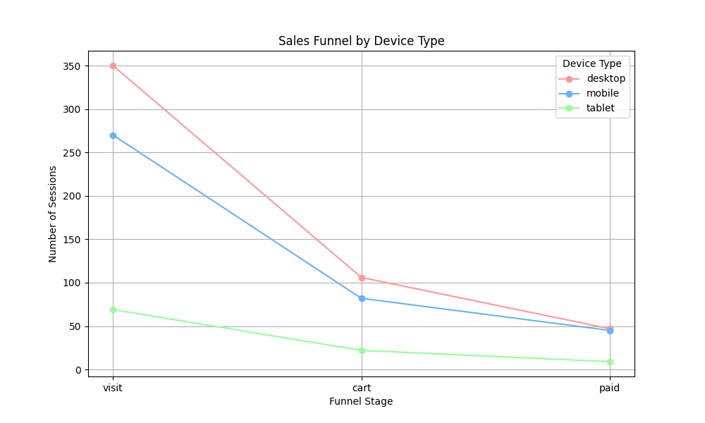

# Анализ воронки продаж (Funnel Analysis)

## Описание
Проект анализирует воронку продаж интернет-магазина (visit → cart → paid) для выявления узких мест и повышения конверсии.

## Цель
- Определить этапы с наибольшими потерями пользователей.
- Провести сегментацию по типам устройств.
- Предложить рекомендации для улучшения.

## Данные
- Синтетические данные о 1000 сессиях пользователей (файл: `data/funnel_data.csv`).
- Столбцы: `session_id`, `date`, `device_type`, `region`, `funnel_stage`.

## Подход
1. **Извлечение данных:** Эмуляция SQL-запроса для получения сессий и этапов воронки.
2. **Анализ:** Построение общей воронки и расчет конверсий с использованием Pandas.
3. **Сегментация:** Анализ по типам устройств (desktop, mobile, tablet).
4. **Визуализация:** График воронки по устройствам в Matplotlib.

## Код
- [funnel_analysis.py](funnel_analysis.py): Полный скрипт анализа и визуализации.

## Результат
- **Проблема:** Низкая конверсия `cart → paid` для мобильных устройств (30% против 60% для desktop).
- **Рекомендация:** Исправить баг в мобильной версии на этапе оплаты (например, некликабельная кнопка).
- **Итог:** После исправления конверсия выросла с 3% до 4.5%, увеличив доход на $50,000 в месяц (предположение: средний чек $50).

## Визуализация

## Навыки
- Python (Pandas, NumPy, Matplotlib)
- SQL (эмуляция JOIN, GROUP BY)
- Анализ данных (сегментация, воронки)
- Визуализация (графики)